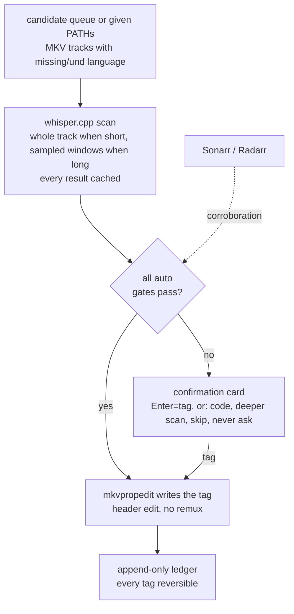

# audio-lang-tagger

Finds MKV audio tracks whose language flag is missing or `und`, guesses the
language by running a short sample through [whisper.cpp][], and asks for
confirmation before writing the tag with `mkvpropedit`.

The edit is a track-header change, not a remux: nothing is re-encoded, no data
is copied, and a 40 GB file is tagged in well under a second. Media servers stop
labelling those tracks "Unknown", and a library-cleanup pass can strip unwanted
audio with the confidence that everything left is identified.

[whisper.cpp]: https://github.com/ggerganov/whisper.cpp

## How a track gets tagged



## Why it is not just "run whisper on everything"

Language detection off a 30-second sample is wrong often enough that blind
tagging is not usable, and it is wrong in a specific way: whisper's language
head fires confidently on music. A cartoon that opens on a title score detects
at p=0.42 while transcribing 99 clean words later in the same track, and a
sung-through short "transcribes" a 219-word `La la la` loop at p=0.86.

So the tool separates the two questions. *Are there words here* is answered from
the transcript (character count, word count, distinct-word ratio), and *which
language* from the detector - and a detection with no transcript behind it is
never offered as the default. Everything else is about making a human's
confirmation cheap:

- Tracks short enough to transcribe whole (~12 min of audio) are scanned whole
  on the first pass, so the first card is conclusive instead of a starting point.
  On a whole-track pass the detector is asked a second time about the densest
  30 seconds of *speech*, because its first reading only ever saw the opening.
- Longer tracks sample four windows and stop at the first one holding words.
- `d` (deep scan) samples 7 more windows for sparse-dialogue content; `f` (full
  scan) transcribes the whole track, the only pass where finding nothing is
  conclusive.
- Every whisper result is cached by path + mtime + track, so an interrupted
  sweep resumes for free. Measured on one file: 34s cold, 1s warm.
- Every applied tag is appended to a TSV ledger (`old value` is always `und`),
  so any batch or misclick is enumerable and reversible.

## Requirements

- Python 3.8+, standard library only
- [whisper.cpp][] (`whisper-cli`, `whisper-cpp` or `whisper` on PATH) and a model
- `ffmpeg` / `ffprobe`
- `mkvtoolnix` (`mkvpropedit`, `mkvmerge`, `mkvextract`)
- Optional: [textual][] for the full-screen UI (`pip install textual`;
  without it the tool falls back to line-mode prompts)
- Optional: [Sonarr][] / [Radarr][], used as corroboration for unattended tagging

[Sonarr]: https://sonarr.tv
[Radarr]: https://radarr.video

```bash
pacman -S whisper-cpp ffmpeg mkvtoolnix-cli     # Arch
brew install whisper-cpp ffmpeg mkvtoolnix      # macOS
mkdir -p ~/.local/share/whisper
curl -L -o ~/.local/share/whisper/ggml-base.bin \
  https://huggingface.co/ggerganov/whisper.cpp/resolve/main/ggml-base.bin
```

The `base` model is what the thresholds below were calibrated against. A larger
one will read differently; re-check the gates before trusting `--auto` with it.

## Install

The tool is one file with no required dependencies beyond the binaries above:

```bash
git clone https://github.com/polybjorn/audio-lang-tagger.git
install -m 755 audio-lang-tagger/audio-lang-tagger.py ~/.local/bin/audio-lang-tagger.py
```

Or run it straight from the checkout. `--version` prints the release.

## Usage

```bash
audio-lang-tagger.py PATH [PATH...]   # work through the given files/dirs
audio-lang-tagger.py                  # work the saved candidate queue
audio-lang-tagger.py --list           # report untagged tracks, change nothing
audio-lang-tagger.py --full           # re-sweep every configured media dir
audio-lang-tagger.py --auto           # tag gate-passing tracks, prompt for the rest
audio-lang-tagger.py --prescan        # unattended: scan + cache, never prompt
audio-lang-tagger.py --bulk zxx PATH  # one code over a range you have judged
audio-lang-tagger.py --plain          # line-mode prompts, no full-screen UI
audio-lang-tagger.py --show-config    # print resolved paths and exit
```

Interactive modes need a tty. Over ssh that means `ssh -t HOST
audio-lang-tagger.py`.

The interactive run is a full-screen app (via [textual][], optional - without
it the tool falls back to line-mode prompts) with a progress header, live scan
status and a strip of recent decisions. Keys are single presses, no Enter;
typing a replacement code starts with `c`.

[textual]: https://textual.textualize.io/

Each card shows what was heard and what it cost:

```
[12/~340] series/Harbour Watch/Season 1/
          Harbour Watch - S01E03.mkv

  track    a1            eac3   6ch   640 kb/s   52m18s   2.4 GB
  whisper  eng           184 words in 1 window
  detector eng 97%
  sonarr   eng           agree
  heard    "right then let's see what the tide brought in…"

  Enter=tag eng    xxx=code    d=deep scan    f=full scan ~4m    s=skip    n=never ask    q=quit
```

`n` records the track in a skip list so it is never asked about again. `u`
(full-screen UI, single level) undoes the last decision and re-shows its card:
a tag is written back to `und` with a corrective ledger row, a never-ask is
taken back out of the skip list. `q` exits cleanly, flushing the scan cache
and pruning the queue.

### Unattended tagging

`--auto` tags without asking only when every gate passes: unanimous detections
at p>=0.90 (or, on a whole-track pass, 0.90 on either the opening or the densest
speech window), a coherent transcript, agreement with Sonarr/Radarr's original
language, year >= 1940, no music/concert genre, a single non-commentary audio
track, and a language outside the `no`/`nn`/`da`/`sv` cluster whisper confuses.
"No speech found" never auto-tags anything.

The intended shape for a large queue is `--prescan` in the background first
(unattended, tags gate-passers, caches everything else), then an interactive
pass that does no scanning at all. An interactive run also serves cached files
first, so a partially prescanned queue still starts with instant cards while
whisper works through the unscanned rest in the background.

### Bulk tagging

`--bulk CODE PATH...` sets one language across a range after a single
confirmation, for the calls no scan can make - a run of pre-sound-era shorts
where `zxx` (no linguistic content) versus `eng` is a human judgement about
sparse dialogue. It never scans, and a cached scan that contradicts the code
holds its file back for the interactive pass. `zxx` is checked far more
suspiciously than a language code, because it claims absence.

## Configuration

Resolved in order: CLI flag, then `AUDIO_LANG_TAGGER_<NAME>` in the environment,
then `~/.config/audio-lang-tagger.conf`, then `/etc/audio-lang-tagger.conf`
(`KEY=value`, `#` comments), then the built-in default. A user file therefore
wins over the one config management writes.

| Flag | Config key | Default |
|---|---|---|
| `--media-dir DIR` (repeatable) | `MEDIA_DIRS` (`:`-separated) | none - only `--full` and queue runs need it |
| `--state-dir DIR` | `STATE_DIR` | `$XDG_STATE_HOME/audio-lang-tagger` |
| `--queue-file PATH` | `QUEUE_FILE` | `untagged_audio.json` in the state dir |
| `--model PATH` | `MODEL` | first existing of `~/.local/share/whisper/ggml-base.bin`, `/var/lib/whisper/ggml-base.bin`, `/usr/share/whisper.cpp/ggml-base.bin`, `/usr/local/share/whisper.cpp/ggml-base.bin` |
| `--whisper-bin PATH` | `WHISPER_BIN` | `whisper-cli` / `whisper-cpp` / `whisper` on PATH |
| `--realtime-factor N` | `REALTIME` | `12` |
| `--sonarr-config PATH` | `SONARR_CONFIG` | `/var/lib/sonarr/config.xml` |
| `--radarr-config PATH` | `RADARR_CONFIG` | `/var/lib/radarr/config.xml` |
| `--no-arr` | - | arr lookup enabled |
| `--jobs N` | - | `2` |

### Connecting Sonarr/Radarr

Optional - without them the tool works fully interactively; they gate `--auto`
(original-language corroboration, year, genres) and add an agree/disagree line
to the card. Two ways in:

- **Same host, native install:** automatic. The tool reads the arr's own
  `config.xml` (default `/var/lib/sonarr/`, `/var/lib/radarr/`) and takes the
  port and API key from there. Nothing to configure.
- **Anything else - Docker, another host, non-standard paths:** set
  `SONARR_URL` + `SONARR_API_KEY` (and the `RADARR_` pair). The API key is in
  the arr's UI under Settings > General > Security. For Docker, the URL is
  whatever you publish, e.g. `http://localhost:8989`.

Why only the arrs? Corroboration hinges on the title's *original language* -
whisper hears "this is Italian", the arr knows "this film was made in
Italian", and unattended tagging requires the two to agree independently.
TMDB has that fact and the arrs pass it through their API. Jellyfin scrapes
the same databases but does not store original language, and the Kodi NFO
standard has no field for it either - so neither can stand in, and a
corroboration source that only supplies year and genres would look like a
safety check without being one.

Verify with `--show-config`: it probes each configured arr and prints
`ok (Sonarr 4.0.19.2979)` or what is wrong (unreachable, bad key, wrong URL).
Check it once before relying on `--auto` - at runtime a failed arr lookup
degrades silently to "no corroboration", which just means fewer tracks pass
the auto gates and more reach the interactive card.

`--realtime-factor` is how many times realtime this machine transcribes,
end-to-end including the ffmpeg extract. It sets which tracks are short enough
to scan whole and what the `f` key estimates, and nothing else. Measured
10.5-15x on a 6-core Alder Lake CPU with the `base` model; 12 is the middle.
Re-measure on different hardware.

An example config file is in [`audio-lang-tagger.conf.example`](audio-lang-tagger.conf.example).

## State files

Everything lives in the state dir, and none of it is precious except the ledger:

| File | What it is |
|---|---|
| `lang_tagger_tags.tsv` | append-only ledger of every applied tag |
| `lang_tagger_scans.json` | whisper results by path + mtime + track |
| `lang_tagger_skips.txt` | tracks answered with `n` |
| `untagged_audio.json` | the candidate queue |
| `lang_tagger.{state,instance}.lock` | concurrency guards |

A ledger row is `timestamp, path, track, und->code, mode, probability, chars`,
where mode is `auto`, `manual` or `bulk`. To undo a tag, feed columns 2-4 back
to `mkvpropedit`:

```bash
mkvpropedit "FILE" --edit track:a1 --set language=und
```

### Queue format

`--queue-file` points at JSON an external library scanner writes:

```json
{"date": "2026-08-09", "files": 1500, "tracks": 1503, "paths": ["/srv/media/..."]}
```

Only `paths` is required; `date` labels the run on screen and `files`/`tracks`
seed the workload counter before the background recount lands. Without a queue,
the first run falls back to a full sweep and writes one on the way out. Finished
files are pruned from it on exit, so the counter starts from a true number next
time.

On the fleet this was extracted from, that scanner is media-tools'
`video-cleanup` (a companion library-cleanup tool, not yet published): its
health pass already probes every stream, so it writes the queue as a
by-product and reads back `lang_tagger_skips.txt` to leave the tracks
answered with `n` out of it. That only works while both tools point at the
same state dir, which is the one setting they have to agree on. Any scanner
that writes the JSON above works the same way.

## Concurrency

`--jobs` scans run at once, at `cpu_count / jobs` whisper threads each. On a
6-core box 2 jobs was the best of 1/2/3/6 and only 1.28x one job, because
whisper already parallelises internally and the work is memory-bandwidth bound.
Raising it further buys nothing.

Two runs at once are survivable but not recommended: writes to the shared JSON
files are read-modify-write under an `flock` so they merge rather than clobber,
and a second instance is announced (a second `--prescan` is refused). What is
still not safe is both runs reaching the same file.

## Tests

Stdlib only, no framework, run from repo root:

```
python3 -m unittest discover -s tests
```

Smoke coverage: the script imports and builds its parser, and the pure
formatters behave. CI runs the same suite on every push.

## Project status

This is a personal tool, published because the niche is empty. It runs weekly
on one library, and every threshold in the auto gates was calibrated against
the `base` model on a 6-core CPU - treat `--auto` sceptically until you have
watched it on your own content. Bug reports with a `--version` and a ledger
row are welcome; large features may be declined to keep the tool small.

## License

MIT - see [LICENSE](LICENSE).
