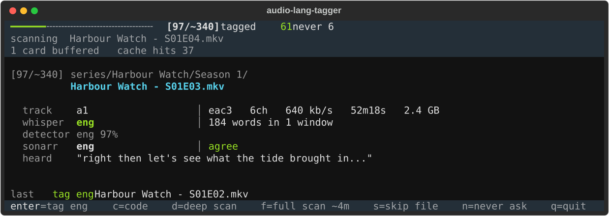
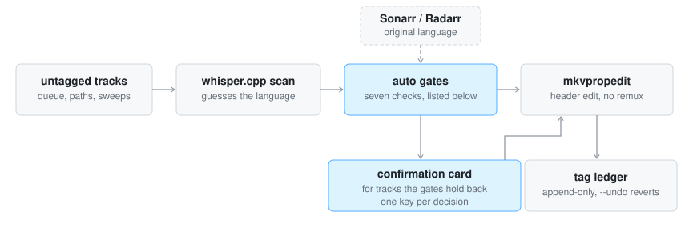

# audio-lang-tagger

Finds MKV audio tracks whose language flag is missing or `und`, guesses the
language by running a short sample through [whisper.cpp][], and asks for
confirmation before writing the tag with `mkvpropedit`.

The edit is a track-header change, not a remux: nothing is re-encoded, no data
is copied, and a 40 GB file is tagged in well under a second. Media servers stop
labelling those tracks "Unknown", and a cleanup pass can finally act on them:
track strippers like [radarr-striptracks][striptracks] have to keep every `und`
track, because removing one blind risks leaving a file with no audio at all.
Identify them and that pass can decide.

[whisper.cpp]: https://github.com/ggerganov/whisper.cpp
[striptracks]: https://github.com/TheCaptain989/radarr-striptracks



## Quick start

Needs Python 3.8+ (nothing to `pip install`) and three common tools:

```bash
brew install whisper-cpp ffmpeg mkvtoolnix        # macOS
sudo pacman -S whisper-cpp ffmpeg mkvtoolnix-cli  # Arch
# Debian/Ubuntu: sudo apt install ffmpeg mkvtoolnix, and build whisper.cpp
# from source (https://github.com/ggerganov/whisper.cpp)
```

Fetch the language model once (~150 MB):

```bash
mkdir -p ~/.local/share/whisper
curl -L -o ~/.local/share/whisper/ggml-base.bin \
  https://huggingface.co/ggerganov/whisper.cpp/resolve/main/ggml-base.bin
```

Get the script - it is one file, nothing else to install - and point it at
some media:

```bash
curl -O https://raw.githubusercontent.com/polybjorn/audio-lang-tagger/main/audio-lang-tagger.py
chmod +x audio-lang-tagger.py
./audio-lang-tagger.py --list /path/to/your/media
```

`--list` only reports - it tells you how many untagged tracks you have and
changes nothing. When you are ready to tag, run the same command without
`--list` and confirm each track as it comes up:

```bash
./audio-lang-tagger.py /path/to/your/media
```

If anything is missing the tool says exactly what and how to install it, and
`--show-config` prints every resolved path and connection. To have it on your
PATH: `install -m 755 audio-lang-tagger.py ~/.local/bin/`. Everything below
is detail you can come back to later.

## Usage

```bash
audio-lang-tagger.py PATH [PATH...]   # work through the given files/dirs
audio-lang-tagger.py                  # work the saved candidate queue
audio-lang-tagger.py --list           # report untagged tracks, change nothing
audio-lang-tagger.py --full           # re-sweep every configured media dir
audio-lang-tagger.py --auto           # tag gate-passing tracks, prompt for the rest
audio-lang-tagger.py --prescan        # unattended: scan + cache, never prompt
audio-lang-tagger.py --bulk zxx PATH  # one code over a range you have judged
audio-lang-tagger.py --plain          # line-mode prompts, no full-screen UI
audio-lang-tagger.py --ledger         # review the last 20 applied tags
audio-lang-tagger.py --undo 3         # revert the last 3 tags to und
audio-lang-tagger.py --show-config    # print resolved paths and exit
audio-lang-tagger.py --version        # print the version and exit
```

Trailers, samples and `Extras/` folders are left out of every sweep, by the
naming conventions Plex, Emby and Jellyfin share. `--ignore PATTERN` adds your
own, `--no-ignore` turns the whole filter off, and a file named on the command
line is always scanned: asking for a path is asking for that path.

Interactive modes need a tty. Over ssh that means `ssh -t HOST
audio-lang-tagger.py`.

The interactive run is a full-screen app (via [textual][], optional -
`pip install textual`; without it the tool falls back to plain line-mode
prompts) - the screenshot at the top of this page. A progress header, live
scan status and the last decision taken frame the card; keys are single
presses, no Enter, and typing a replacement code starts with `c`.

[textual]: https://textual.textualize.io/

`n` records the track in a skip list so it is never asked about again. `u`
(full-screen UI, single level) undoes the last decision and re-shows its card:
a tag is written back to `und` with a corrective ledger row, a never-ask is
taken back out of the skip list. `q` exits cleanly, flushing the scan cache
and pruning the queue.

## Connecting Sonarr/Radarr

Optional - without them the tool works fully interactively; they gate `--auto`
(original-language corroboration, year, genres) and add an agree/disagree line
to the card. Two ways in:

- **Same host, native install:** automatic. The tool reads the arr's own
  `config.xml` (default `/var/lib/sonarr/`, `/var/lib/radarr/`) and takes the
  port and API key from there. Nothing to configure.
- **Anything else - Docker, another host, non-standard paths:** set
  `SONARR_URL` + `SONARR_API_KEY` (and the `RADARR_` pair). The API key is in
  the arr's UI under Settings > General > Security. For Docker, the URL is
  whatever you publish, e.g. `http://localhost:8989`.

Verify with `--show-config`: it probes each configured arr and prints
`ok (Sonarr 4.0.19.2979)` or what is wrong (unreachable, bad key, wrong URL).
Check it once before relying on `--auto` - at runtime a failed arr lookup
degrades silently to "no corroboration", which just means fewer tracks pass
the auto gates and more reach the interactive card.

Why only the arrs? Corroboration hinges on the title's *original language*:
whisper hears "this is Italian", the arr knows "this film was made in
Italian", and unattended tagging requires the two to agree independently.
Jellyfin and the Kodi NFO standard do not store that fact, so neither can
stand in ([design notes][notes]).

## How it decides

<picture>
  <source media="(prefers-color-scheme: dark)" srcset="docs/pipeline-dark.svg">
  
</picture>

Language detection off a 30-second sample is wrong often enough that blind
tagging is not usable, and it is wrong in two opposite ways: whisper's language
head fires confidently on music, and reads low on a track that opens with a
title score. The [design notes][notes] carry the measurements.

So the tool separates the two questions. *Are there words here* is answered from
the transcript (character count, word count, distinct-word ratio), and *which
language* from the detector - and a detection with no transcript behind it is
never offered as the default. Everything else is about making a human's
confirmation cheap:

- Tracks short enough to transcribe whole (~12 min of audio) are scanned whole
  on the first pass, so the first card is conclusive instead of a starting point.
  On a whole-track pass the detector is asked a second time about the densest
  30 seconds of *speech*, because its first reading only ever saw the opening.
- Longer tracks sample four windows and stop at the first one holding words.
- `d` (deep scan) samples 7 more windows for sparse-dialogue content; `f` (full
  scan) transcribes the whole track, the only pass where finding nothing is
  conclusive.
- Every whisper result is cached by path + mtime + track, so an interrupted
  sweep resumes for free. Measured on one file: 34s cold, 1s warm.
- Every applied tag is appended to a TSV ledger (`old value` is always `und`),
  so any batch or misclick is enumerable and reversible.

The `base` model on a 6-core CPU is what every threshold was calibrated
against. A larger model, or a library unlike the one it was tuned on, will
read differently - watch `--auto` on your own content before trusting it.

### Unattended tagging

`--auto` tags without asking only when every gate passes. The seven gates, and
the constants at the top of the script that tune them - if your library needs
different thresholds, that is where to change them:

1. **Unanimous, confident detections** - every sampled window reports the same
   language at p >= 0.90; a whole-track pass reaches 0.90 on either the opening
   or the densest speech window (`AUTO_PROB`)
2. **Coherent transcript** - enough alpha characters, enough words, enough
   distinct vocabulary to rule out music hallucination (`AUTO_MIN_CHARS`,
   `AUTO_MIN_WORDS`, `AUTO_MIN_UNIQUE`; long transcripts:
   `AUTO_LONG_MIN_DISTINCT`, `AUTO_LONG_MIN_UNIQUE`)
3. **Arr agreement** - Sonarr/Radarr's original language matches the detection;
   no arr metadata means no auto-tagging at all
4. **Year** - 1940 or later, using the episode's own air year where Sonarr
   knows it (`AUTO_MIN_YEAR`; older content is sparse-dialogue territory)
5. **Genre** - not music or concert (`AUTO_EXCLUDE_GENRES`)
6. **One audio track** - a single non-commentary track in the file
7. **Unambiguous language** - outside the `no`/`nn`/`da`/`sv` cluster whisper
   confuses (`AUTO_EXCLUDE_ISO1`)

"No speech found" never auto-tags anything.

The intended shape for a large queue is `--prescan` in the background first
(unattended, tags gate-passers, caches everything else), then an interactive
pass that does no scanning at all. An interactive run also serves cached files
first, so a partially prescanned queue still starts with instant cards while
whisper works through the unscanned rest in the background.

### Bulk tagging

`--bulk CODE PATH...` sets one language across a range after a single
confirmation, for the calls no scan can make - a run of pre-sound-era shorts
where `zxx` (no linguistic content) versus `eng` is a human judgement about
sparse dialogue. It never scans, and a cached scan that contradicts the code
holds its file back for the interactive pass. `zxx` is checked far more
suspiciously than a language code, because it claims absence.

## Reference

The [design notes][notes] cover the reasoning and the calibration behind all of
the above. What follows is lookup detail.

[notes]: docs/design-notes.md

<details>
<summary><b>Configuration</b> - flags, environment, config file</summary>

Resolved in order: CLI flag, then `AUDIO_LANG_TAGGER_<NAME>` in the environment,
then `~/.config/audio-lang-tagger.conf`, then `/etc/audio-lang-tagger.conf`
(`KEY=value`, `#` comments), then the built-in default. A user file therefore
wins over the one config management writes.

| Flag | Config key | Default |
|---|---|---|
| `--media-dir DIR` (repeatable) | `MEDIA_DIRS` (`:`-separated) | none - only `--full` and queue runs need it |
| `--state-dir DIR` | `STATE_DIR` | `$XDG_STATE_HOME/audio-lang-tagger` |
| `--queue-file PATH` | `QUEUE_FILE` | `untagged_audio.json` in the state dir |
| `--model PATH` | `MODEL` | first existing of `~/.local/share/whisper/ggml-base.bin`, `/var/lib/whisper/ggml-base.bin`, `/usr/share/whisper.cpp/ggml-base.bin`, `/usr/local/share/whisper.cpp/ggml-base.bin` |
| `--whisper-bin PATH` | `WHISPER_BIN` | `whisper-cli` / `whisper-cpp` / `whisper` on PATH |
| `--realtime-factor N` | `REALTIME` | `12` |
| `--sonarr-config PATH` | `SONARR_CONFIG` | `/var/lib/sonarr/config.xml` |
| `--radarr-config PATH` | `RADARR_CONFIG` | `/var/lib/radarr/config.xml` |
| `--ignore PATTERN` (repeatable) | `IGNORE` (`:`-separated) | trailers, samples, extras folders |
| `--no-ignore` | - | filter enabled |
| `--no-arr` | - | arr lookup enabled |
| `--jobs N` | - | `2` |

`--realtime-factor` is how many times realtime this machine transcribes,
end-to-end including the ffmpeg extract. It sets which tracks are short enough
to scan whole and what the `f` key estimates, and nothing else. Measured
10.5-15x on a 6-core Alder Lake CPU with the `base` model; 12 is the middle.
Re-measure on different hardware.

An example config file is in [`audio-lang-tagger.conf.example`](audio-lang-tagger.conf.example).

</details>

<details>
<summary><b>State files</b> - the ledger, and undoing a tag</summary>

Everything lives in the state dir, and none of it is precious except the ledger:

| File | What it is |
|---|---|
| `lang_tagger_tags.tsv` | append-only ledger of every applied tag |
| `lang_tagger_scans.json` | whisper results by path + mtime + track |
| `lang_tagger_skips.txt` | tracks answered with `n` |
| `untagged_audio.json` | the candidate queue |
| `lang_tagger.{state,instance}.lock` | concurrency guards |

A ledger row is `timestamp, path, track, und->code, mode, probability, chars`,
where mode is `auto`, `manual`, `bulk` or `undo`.

`--ledger [N]` prints the tail of it, which is how you check what `--auto`
did while you were not watching. `--undo N` reverts the last N tags that are
still in force, after one confirmation:

```bash
audio-lang-tagger.py --ledger 50
audio-lang-tagger.py --undo 3
```

An undo appends its own corrective row rather than editing history, so a track
that was reverted and later re-tagged is counted once, at its latest value. A
track whose header no longer says what the ledger recorded is left alone and
reported: something other than this tool changed it. For a single file by hand,
the row gives `mkvpropedit` everything it needs:

```bash
mkvpropedit "FILE" --edit track:a1 --set language=und
```

</details>

<details>
<summary><b>Queue format</b> - feeding the tool from an external scanner</summary>

`--queue-file` points at JSON an external library scanner writes:

```json
{"date": "2026-08-09", "files": 1500, "tracks": 1503, "paths": ["/srv/media/..."]}
```

Only `paths` is required; `date` labels the run on screen and `files`/`tracks`
seed the workload counter before the background recount lands. Without a queue,
the first run falls back to a full sweep and writes one on the way out. Finished
files are pruned from it on exit, so the counter starts from a true number next
time.

On the fleet this was extracted from, that scanner is media-tools'
`video-cleanup` (a companion library-cleanup tool, not yet published): its
health pass already probes every stream, so it writes the queue as a
by-product and reads back `lang_tagger_skips.txt` to leave the tracks
answered with `n` out of it. That only works while both tools point at the
same state dir, which is the one setting they have to agree on. Any scanner
that writes the JSON above works the same way.

</details>

<details>
<summary><b>Concurrency</b> - jobs, threads, parallel runs</summary>

`--jobs` scans run at once, at `cpu_count / jobs` whisper threads each. On a
6-core box 2 jobs was the best of 1/2/3/6 and only 1.28x one job, because
whisper already parallelises internally and the work is memory-bandwidth bound.
Raising it further buys nothing.

Two runs at once are survivable but not recommended: writes to the shared JSON
files are read-modify-write under an `flock` so they merge rather than clobber,
and a second instance is announced (a second `--prescan` is refused). What is
still not safe is both runs reaching the same file.

</details>

<details>
<summary><b>Tests</b></summary>

Stdlib only, no framework. Clone the repo and run from its root:

```
git clone https://github.com/polybjorn/audio-lang-tagger.git
cd audio-lang-tagger
python3 -m unittest discover -s tests
```

Smoke coverage: the script imports and builds its parser, and the pure
formatters behave. CI runs the same suite on every push.

</details>

## Scope

A personal tool, published because the tools that already do this tag
unattended on a confidence threshold, and the measurements in the [design
notes][notes] say a threshold cannot carry that weight. [ULDAS][uldas] covers
more ground (subtitles, remuxing, a web UI, GPU) and is the better fit for
hands-off batch tagging. This one assumes you would rather confirm, and spends
its effort on making each confirmation cheap and every tag reversible. Do not
point both at one library: two tools writing track headers, one ledger between
them.

It runs weekly on one library. Bug reports with a `--version` and a ledger row
are welcome; large features may be declined to keep the tool small.

[uldas]: https://github.com/netplexflix/MKV-Undefined-Audio-Language-Detector
